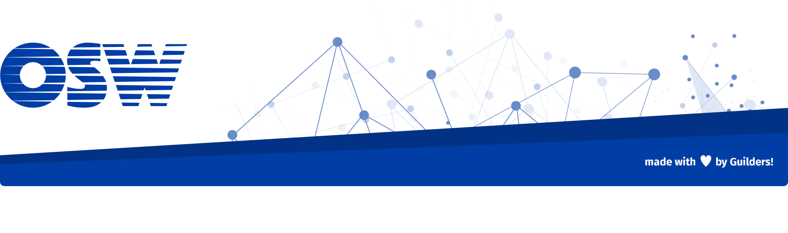

# Batimagen

> Analizador de ficheros utilizando metadatos y APIs de terceros. Incluye un [honeypot](https://es.wikipedia.org/wiki/Honeypot) (Opcional)

El proyecto utiliza la librería [ExifTool de Phil Harvey](https://www.sno.phy.queensu.ca/~phil/exiftool/) para extraer la información de los [metadatos del fichero](https://es.wikipedia.org/wiki/Metadatos).

También se realiza un analisis en busca de virus utilizando [virustotal](https://www.virustotal.com/es/). En el caso de las imagenes el fichero en enviado a [Google vision API](https://cloud.google.com/vision/?hl=es) para detectar diversos parámetros como imagenes similares, textos, detección de caras, etc...

Utilizamos Node.js y Pug para hacer un aplicación web de tipo server render.

- [Ficheros soportados](https://www.sno.phy.queensu.ca/~phil/exiftool/#supported)

**Motivación**

Creamos esta herramienta para mostrar al mundo la importancia de los metadatos y la privacidad. Nuestro objetivo final es concienciar y enseñar un buen uso de la tecnologia para la ciudadania en general.

### Equipo

 - [Ulises Gascón (@UlisesGascon)](https://github.com/ulisesGascon) (Leader Backend)
 - [Elena Mateos (@UlisesGascon)](https://github.com/ulisesGascon) (Leader Frontend)

##### Agradecimientos

 - [Carlos Crisóstomo (@kr0n0)](https://github.com/kr0n0) (Security researcher)
 - [Cybersecurity Guild](https://guilds.osweekends.com) (Communtiy Support)
 - [Open Source Weekends](https://osweekends.com) (Guilds Support)

##### Necesitamos

Necesitamos ayuda, ¡únete!

 - Traductor: ¿Nos ayudas a crear este portal en ingles?
 - Documentación: ¿Nos ayudas a explicar mejor que son los metadatos al mundo?

### Demo

El proyecto esta disponible para su descarga y ejecución en local.

### Tecnología utilizada

#### Dependencias
- **express**: Gestión del servidor HTTP
- **express-fileupload**: Gestión de ficheros desde el cliente por peticiones POST
- **node-exiftool**: Wrapper de exiftool para Nodejs
- **pug**: Motor de plantillas del backend
 

### Cómo contribuir en el proyecto

**Más informacion en [CONTRIBUTING.md](CONTRIBUTING.md)**

### ¿Cómo usarlo?.

#### TL:DR;

Solo necesitas tener Node y descargarte [exiftool](https://www.sno.phy.queensu.ca/~phil/exiftool/install.html)

#### Instalación

**Prepara el entorno**
- [Instalar Nodejs](https://nodejs.org/es/download/)
- [Instalar exiftool](https://www.sno.phy.queensu.ca/~phil/exiftool/install.html)

**Descarga el proyecto**

`git clone https://github.com/OSWeekends/batimagen.git`

**Lanza el proyecto en local**

`npm install && npm start`

### Estado del proyecto.

Ahora mismo estamos en desarrollo activo del primer MVP (Sprint 1 y 0 en paralelo)

### Licencia

GPL-3.0

